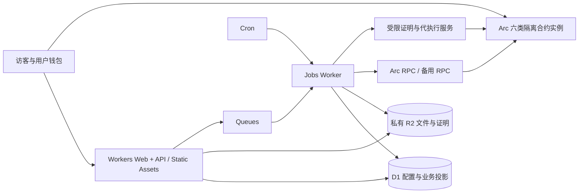

# Architecture 01 · 系统设计

## 1. 部署边界

ArcBox 网站与业务服务运行于Cloudflare，资金规则运行于Arc。Cloudflare不是区块链节点，也不替代钱包签名或链上结算。首版不需要VPS；不承诺六工具永远无需外部邮件/文件安全服务。



Static Assets、D1、Queues/R2/Cron能力依据见 [S04–S06、S10–S12](../research/SOURCES-AND-ASSUMPTIONS.md)。图是拟定架构，不是当前已创建的Cloudflare资源。

## 2. 技术选择与非目标

建议TypeScript、React/Vite、轻量Workers API路由（如Hono）、共享schema验证、viem/wagmi钱包适配、Solidity/Foundry测试。M0固定经验证的版本与lockfile，不在本包编造最新版本号。

工具目录可预渲染；工作区为客户端应用；公开分享页可由Worker生成必要的meta/OG再返回应用壳。无需默认引入Next.js、服务器端渲染全站、微服务网格、Redis、Postgres、持续运行WebSocket守护进程。

推荐仓库布局（实施阶段创建）：

```
apps/web/             页面、路由、钱包、双语
workers/api/          同站API与Static Assets入口
workers/jobs/         queue/scheduled handlers
workers/attestor/     可选、私有service binding的受限签名/代执行
packages/domain/     金额、schema、状态投影、规则类型
packages/contracts/  ABI、部署清单与只读客户端
contracts/           Solidity、Foundry、部署脚本、测试
migrations/          D1版本迁移
fixtures/            仅合成数据，按demo/testnet隔离
scripts/             核验、部署、补扫、完整性检查
```

## 3. 服务职责

**Web/API Worker：**认证、工作区权限、草稿、公开详情、付款intent、交易计划、私有文件访问。不能自己把订单改成已付款，不能暴露通用signTransaction接口。

**Jobs Worker：**确认交易、历史日志补扫、outbox投递、权益生成、名单构建、提醒、可用性检查。每个任务有边界/游标，不能无限循环。

**Attestor Worker（Deliver需要）：**对已核验订单与固定文件版本签可访问证明；可持受限业务签名密钥。代执行账户仅持小额Gas预算，只能调用批准实例的markAvailable等白名单动作；绝不持用户本金或合约管理员/部署密钥。无可用预算/证明服务时停止新增Deliver付款。

代执行不是系统资金真相源。用户/卖家拿到合法证明后也可提交，退款路径不要求代执行服务在线。支付、放款、退款、奖励领取默认由有权钱包发起；代付Gas不是首版承诺。

## 4. 三类真相源

| 数据 | 真相源 | D1作用 |
|---|---|---|
| 草稿、说明、通知偏好、角色 | D1及签名审计 | 主记录 |
| 本金、credits、已领取、规则时间、root | Arc已部署合约 | 可重建的投影，不覆盖链状态 |
| 文件内容、证据、完整Merkle制品 | R2对象 + hash + 备份 | 索引与访问控制 |

链上不能重建丢失文件，R2不能决定退款是否完成，D1不能证明线下事实。三个边界分离。

## 5. 交易确认：快速路径与补扫路径共用处理器

客户端提交txHash→API验证格式/订单关联→入确认队列。处理器检查chainId、receipt成功、部署白名单与ABI版本、业务事件中的payer/amount/orderId/rulesHash，取得blockHash和logIndex。

同一处理器接受定时扫描事件，事件去重键为(chainId,txHash,logIndex)，同时保存blockHash与contractAddress。若相同键出现不一致blockHash/内容，进入隔离告警，而不是覆盖已确认记录。

Arc当前文档描述确定性终局与按区块/日志顺序索引，不能照搬“等待12个区块”的固定假设；M0验证实际RPC receipt/finality行为，异常provider相互冲突时fail closed，不临时挑一个方便的数据 [S03]。

原始业务事件+投影更新+outbox在同一D1 batch提交。重复事件唯一键冲突时整批回滚并作为已处理返回；不能INSERT OR IGNORE去重行后仍无条件增加金额。

## 6. 日志扫描与游标

按factory扫描新实例；记录每个实例的deploymentBlock与ABI哈希，再从部署区块补齐该实例事件。创建同一块内发生的子合约事件不能漏掉。

每次扫描有from/to、地址批次和最大日志数；范围按RPC返回规模自适应缩小。只有整段已持久化才推进cursor。快速receipt处理不擅自推进历史cursor。长期未活跃实例可降低刷新频率，但已有退款、挑战窗口仍须按截止索引提醒。

只监听ArcBox白名单业务事件作为订单真相，不用整条链USDC流水决定业务。原生/代币Transfer的双接口语义只用于辅助对账，防止重复入账；旧搜索摘要可能过期，以当前资料与样例receipt复验为准 [S02/S03]。

## 7. D1与任务一致性

D1提供batch事务语义 [S10]；业务实现需用唯一约束和版本CAS。条件UPDATE影响0行不是SQL异常，不能假定batch会因此自动回滚；后续写入必须同样依赖有效的operation token/版本条件，或使用受验证的原子SQL方案。

outbox产生后，dispatcher先发送消息后标记已发送；崩溃可能重发，消费者inbox按effectKey去重。不可把“队列发送成功”与D1提交当作一个分布式事务。外部邮件可能重复但要保持内容一致，资金合约本身另做幂等。

任务默认设计重试最多8次，指数退避/抖动，受平台可配置范围约束；超过后DLQ、告警、人工重放。业务deadline检查每次执行都重读链上时间/状态，迟到任务不执行过期动作。

## 8. API性能与缓存

静态文件长缓存且hash命名；公开工具说明可短缓存。订单、资格、文件授权、签名、资金可操作状态private/no-store。不要用CDN缓存另一个钱包的领取结果。

D1初期不启用读副本处理敏感决策；需要读副本时使用Sessions/bookmark确保读到所需版本 [S10]。分页使用cursor，避免全表扫描；分析报表异步汇总，不在首页SUM所有历史字符串金额。

## 9. 文件与名单资源约束

大文件通过受限上传会话直传R2，Worker不把完整文件读入内存。上传完成由服务端读取对象元数据/实际hash/校验结果后激活；客户端complete回调不代表安全。

Merkle制品先校验名单、确定排序/index与编码，再异步构建并存不可变manifest；只在整个hash校验通过后发布。v1上限10000叶需要M0实际CPU/内存测试；超出任务预算就分段或降低上限，不依赖未创建的后台服务器。

## 10. 环境、可观察性与恢复

local/demo/testnet/production各自隔离。结构化日志包含requestId、jobId、orderId、chainId、contract、block、errorCode；不包含签名密钥、完整下载URL、会话Cookie、CSV或争议原文。

关键告警：索引落后、outbox积压、DLQ、交付证明超时、Gas预算不足、退款失败、资金不变量对账差异、错误chainId。异常时先停新入金与新签名，保留正常退出和只读证据。

部署/数据库回滚不回滚Arc历史。恢复要重新投影链上事件，复核文件/规则hash，清理会话nonce，再开放新订单；详见 [安全运维](05-SECURITY-AND-OPERATIONS.md)。
